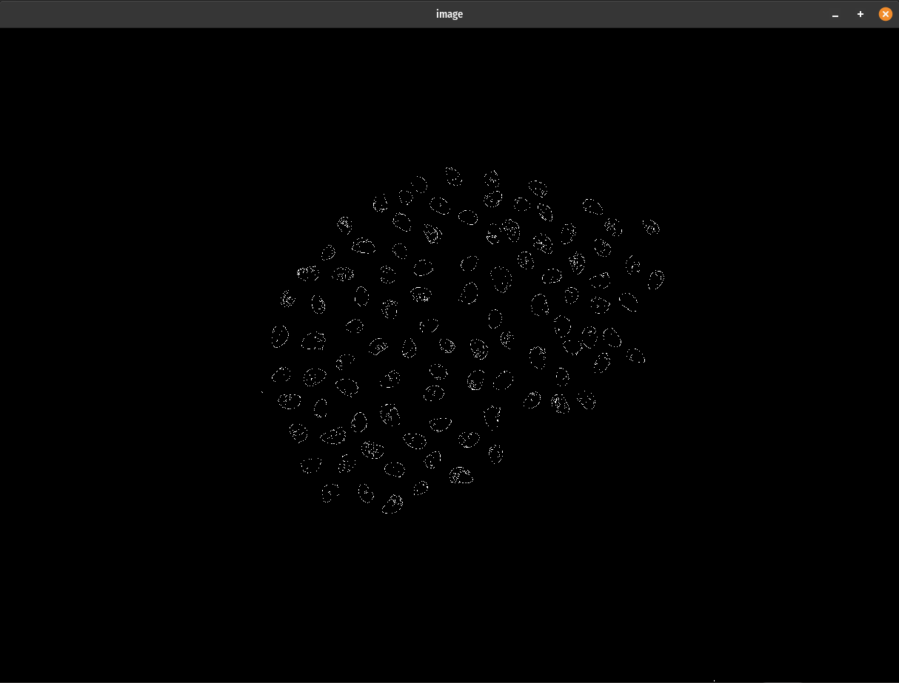
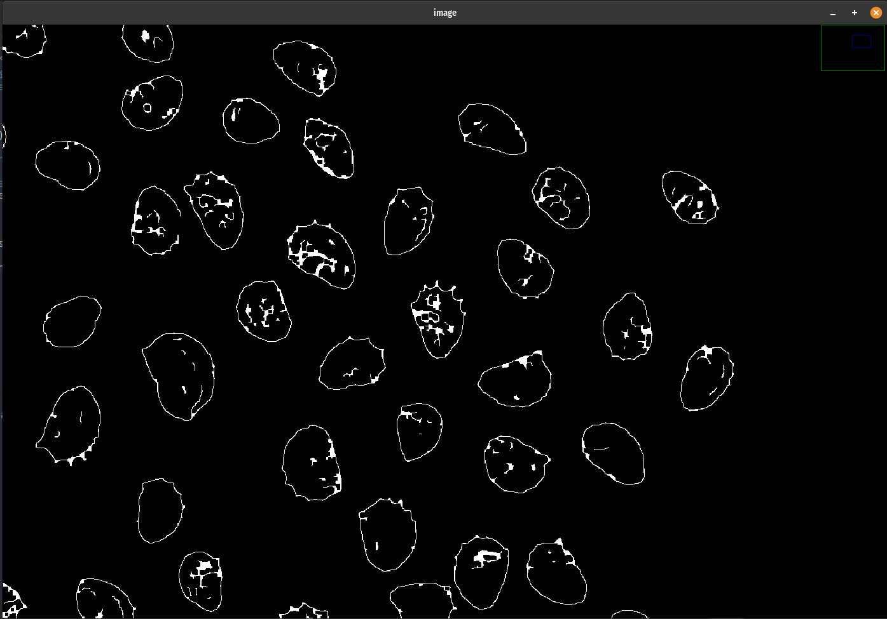

## The Canny Algorithm

## Implementing Canny
In openCV we can use Canny to detect object edges in images. In our image, the background is white while the seeds have fairly distinct boundaries from the background color so we won't have to do any preprocessing on the image.

We will use the function `cv2.Canny()` to return a single channel, binary image where edges are white pixels and non-edge pixels are black. It takes
at minimum three arguments, the `image` source, `threshold1` and `threshold2` for the hysteresis procedure. The code snippet below finds the edges and then prints out the results.
```
>>> edges = cv2.Canny(img, 100, 200)
>>> print(edges)
<class 'numpy.ndarray'>
[[0 0 0 ... 0 0 0]
 [0 0 0 ... 0 0 0]
 [0 0 0 ... 0 0 0]
 ...
 [0 0 0 ... 0 0 0]
 [0 0 0 ... 0 0 0]
 [0 0 0 ... 0 0 0]]
>>> print(edges.shape)
(3307, 4507)
```

Notice how we dropped the final axis from the image numpy array? Now the edges is just a binary image. Now we can view the edges like any other image.
```
>>> showImage(edges)
```


 It looks pretty good except you notice that there are some edges that don't quite connect. Not only that, there are edges in the middle of the seeds that we don't need. There are a few different ways to tackle this, but I will only demonstrate one here.
 
 We can use morphology operations to close these gaps. Specifically, dilating the image based on a defined kernel size, and then eroding the image again. This helps to remove small gaps in the image. OpenCV has good documentation on the <a href="https://docs.opencv.org/3.4/d3/dbe/tutorial_opening_closing_hats.html">cv2.morphologyEx()</a> on their website. We will use a 5x5 kernel size and implement it as shown below. `cv2.morphologyEx()` takes a `src` image, a morphological operation function `op`, and an `kernel` structuring element. All of the morphological types can be found on their website under <a href="https://docs.opencv.org/3.4/d4/d86/group__imgproc__filter.html#ga7be549266bad7b2e6a04db49827f9f32">MorphTypes</a>. We will use `cv2.MORPH_CLOSE` for this example.
```
>>> kernel = np.ones((5, 5), np.uint8)
>>> closed_edges = cv2.morphologyEx(edges, cv2.MORPH_CLOSE, kernel)
>>> showImage(closed_edges)
```

Now the edges should be mostly closed-in. Play around with different thresholds for Canny and kernel sizes for the morphology operations to handle any difficult images.




## Finding Object Contours


