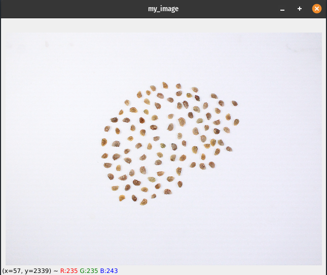

<a href="./">Home</a>

## Getting Started

OpenCV is an extremely powerful library for image processing and analysis and supports several popular programming languages such as C++, Python, and Javascript. For this tutorial we will be using the library for Python. If you don't have it installed yet, you can install it with
`pip install opencv-python`

## Reading images
We can start by importing a few modules to help us out

```
>>> import cv2 #imports opencv
>>> import numpy
```

We have a simple image in our directory that has around a hundred or so seeds photographed on a white background. The seeds are not touching. This should be an easy image for us to work with for the time being. We can read the image using `cv2.imread()`

```
>>> img_path = '../img/pods_IMG_003.JPG'
>>> img = cv2.imread(img_path)
```

It's as simple as that! Now we can take a look at what our image file looks like.

```
>>> print(type(img))
<class 'numpy.ndarray'>
```

Our image is just a Numpy array. We can check the shape of the array as follows
```
>>> print(img.shape)
(3307, 4507, 3)
```

This tells us that our image is 4507x3307 pixels (W x H). Open CV reads in a 2D numpy array for each row of pixels. This means that the `img[0]` should give us the first row of pixels in the image. Accordingly, the 3 columns in that array represent the color values for each channel. By default, opencv reads images in the 'GBR' format not in 'RGB' so keep that in mind when selecting channels.

We can show our image using `cv2.imshow()`. I like to create named windows so I can specify details such as the size of the window (`cv2.WINDOW_NORMAL`), etc. Passing in a `0` to `cv2.waitKey()` allows to automatically closing the image window upon any keystroke. You can manually set it to be a specific key if you wanted, or pass an integer number in milliseconds to tell it to close after a given amount of time has passed.

```
cv2.namedWindow('my_image', cv2.WINDOW_NORMAL)
cv2.imshow('my_image', img)
cv2.waitKey(0)
cv2.destroyWindow()
```
A new window should pop up like so


We will be looking at images a lot so let's write a a function to make our lives easier.
```
def showImage(src):
	'''
	Shows an image and closes it upon a keystroke
	'''
	cv2.namedWindow('image', cv2.WINDOW_GUI_NORMAL)
	cv2.imshow('image', src)
	if cv2.waitKey(0) & 0xFF == ord('q'):
		cv2.destroyWindow('image')

```

Now you can call the function on any image like this to open a window and close when you press `q`.
```
showImage(img)
```

### Test Header
<div>
	<a href="./" align="left">Home</a><a href="canny" align="right">Edge detection and object contours</a>
</div>

Testing